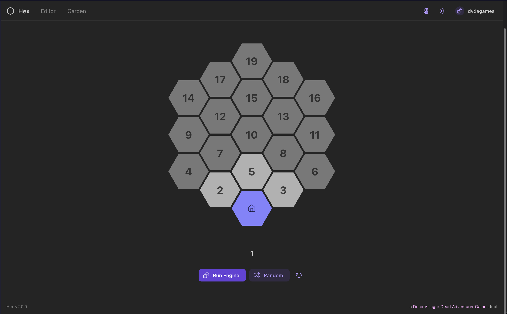

# Hex v2

Hex is an application for managing
[Hex Flower Engines](https://goblinshenchman.wordpress.com/2018/10/25/2d6-hex-power-flower/)
for any tabletop game in the browser.

## Create and Share Hex Flower Engines

In the Hex application, you can create your own Hex Flower Engines, share them with your players, and even publish them to the Garden, where other users can find them and use them in their own games.

The Hex Editor allows you to choose a label, icon, color, and description for each Hex cell, and also customize the Hex Flower Engine movement rules for each roll outcome for that cell.

**Coming Soon**:

- Fork published engines and save your own version of them with modifications
- Use movement rules other than `2d6` and `1d19`
- Offline -> Online sync of engine state and editor state in case you lose network connection while using the application

### Legacy Version

The legacy version of this application is still hosted on GitHub Pages, but `v2` is a much better application for your needs and provides an interface for you to configure your own Hex Flower Engines.

It currently supports two engines:

- `Standard Hex Flower Engine`: basic hex flower engine with standard movement rules
  as described in the
  [article linked above](https://goblinshenchman.wordpress.com/2018/10/25/2d6-hex-power-flower/)
- `SKT Weather Engine`: modified hex flower engine built for a specific weather
  generator for a D&D campaign; rules are described
  [here](https://github.com/chrisman/skookums-and-dragons/wiki/House-rules#weather)

**Demo**: [https://dvdagames.github.io/react-hex-flower-engine/](https://dvdagames.github.io/react-hex-flower-engine/)

## How does it work?

The Hex Flower Engine's cells and travelling rules are described in a JavaScript
Object and the application leverages
[`@dvdagames/js-die-roller`](https://github.com/DVDAGames/js-die-roller) for
generating the next move.

It currenty allows you to roll `2d6` and move the appropriate direction on the
grid or roll `1d19` and move directly to the corresponding hex.

Each engine's current state is stored in `localStorage` so that users can come back
to the application and resume their engine where they left off and even swap engines
mid-session and not lose their current state.

## Resources

- https://goblinshenchman.wordpress.com/2018/10/25/2d6-hex-power-flower/
- https://goblinshenchman.wordpress.com/2019/07/10/hex-flowers-game-engines-as-found-in-the-wild/
- https://goblinshenchman.files.wordpress.com/2019/04/ithots.png
